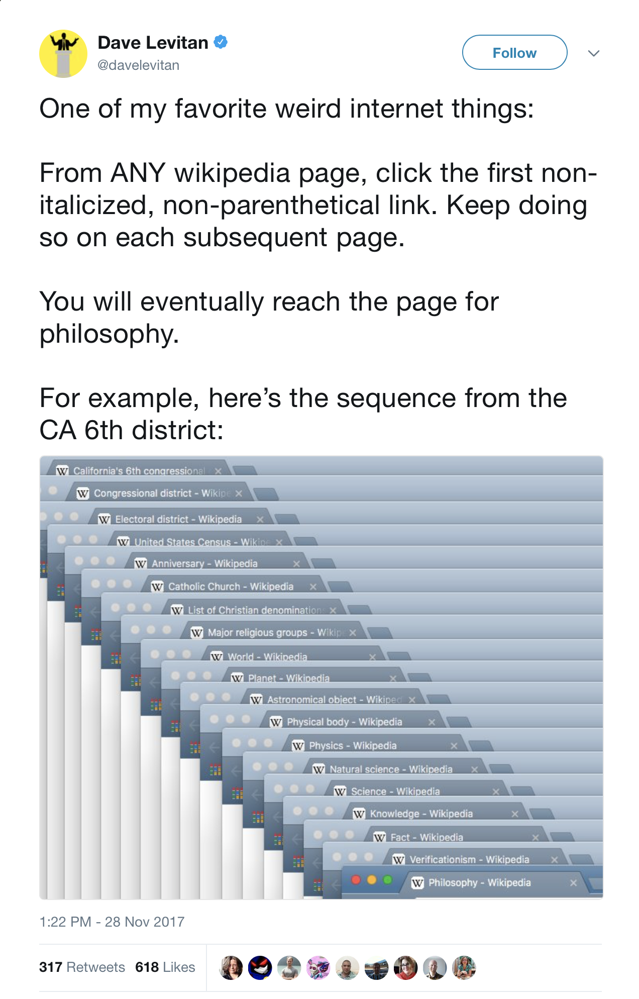
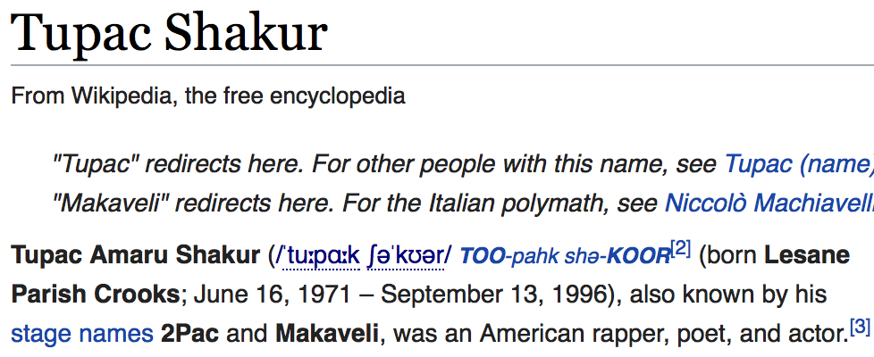

# wiki to philosophy

So. Here it is. In Python. With Beautiful soup. Obviously.

Also: I disproved the hypothesis: there are many loops (`/wiki/Accounting`), (`/wiki/Cardinal_direction`)

## Best of

### Unbalanced parentheses:

### Random links leading to pornographic images:

## Considerations

I took the [_Top-100 list_](https://en.wikipedia.org/wiki/Wikipedia:Multiyear_ranking_of_most_viewed_pages#Top-100_list) and took all the articles that are not meta.

Those infoboxes, "this article needs work" boxes, images, table of contents (sometimes) are before the rest of the article in the html code. They all had to be sorted out.

Citations like [5] or [edit] links are also links. Don't want those.

I cannot categorically delete all parentheses from the code. It will damage links like `/wiki/set_(mathematics)`.

## Acknowledgement

Thanks [@davelevitan](https://twitter.com/davelevitan) for this excelent challenge! It took about 2 hours.

## Sample output

### Simple (`debug = False`)

	-                              found: 18 steps
	Wiki                           found: 22 steps
	Facebook                       loop! (/wiki/Accounting)
	YouTube                        broken link!(https://pinterest.com/pin/765682374120145462/?source_app=android)
	404.php                        found: 20 steps
	United States                  found: 17 steps
	Google                         found: 12 steps
	Donald Trump                   found: 12 steps
	Wikipedia                      found: 22 steps
	Barack Obama                   found: 12 steps
	India                          loop! (/wiki/Cardinal_direction)
	World War II                   found: 9 steps
	Michael Jackson                found: 20 steps
	Malware                        found: 21 steps
	Sex                            found: 8 steps
	United Kingdom                 found: 9 steps
	Lady Gaga                      found: 13 steps
	Eminem                         found: 10 steps
	The Beatles                    found: 10 steps
	Adolf Hitler                   found: 15 steps
	Justin Bieber                  broken link!(https://pinterest.com/pin/765682374120145462/?source_app=android)
	World War I                    found: 9 steps
	The Big Bang Theory            found: 17 steps
	Steve Jobs                     found: 8 steps
	Canada                         found: 17 steps
	Game of Thrones                found: 17 steps
	How I Met Your Mother          found: 17 steps
	Academy Awards                 found: 24 steps
	Lil Wayne                      found: 17 steps
	Kim Kardashian                 found: 19 steps
	Australia                      found: 17 steps
	Cristiano Ronaldo              found: 17 steps
	XHamster                       found: 10 steps
	Miley Cyrus                    found: 33 steps
	Elizabeth II                   broken link!(https://en.wiktionary.org/wiki/Special:Search/potent)
	List of Presidents of the United States found: 11 steps
	Harry Potter                   found: 19 steps
	Rihanna                        broken link!(https://en.wiktionary.org/wiki/polynym)
	Japan                          found: 17 steps
	Selena Gomez                   found: 34 steps
	Glee (TV series)               found: 24 steps
	Germany                        found: 17 steps
	The Walking Dead (TV series)   found: 18 steps
	Abraham Lincoln                found: 12 steps
	Taylor Swift                   found: 16 steps
	Star Wars                      found: 17 steps
	Indigenous australian          found: 10 steps
	China                          found: 8 steps
	Lionel Messi                   found: 15 steps
	Breaking Bad                   found: 17 steps
	Johnny Depp                    found: 8 steps
	New York City                  found: 15 steps
	Tupac Shakur                   found: 15 steps
	Web scraping                   found: 20 steps
	France                         found: 15 steps
	Kanye West                     found: 11 steps
	Russia                         found: 17 steps
	Stephen Hawking                found: 13 steps
	Albert Einstein                found: 20 steps
	Earth                          found: 22 steps
	Angelina Jolie                 found: 25 steps
	Mark Zuckerberg                loop! (/wiki/Accounting)
	Internet Movie Database        found: 20 steps
	Leonardo DiCaprio              found: 30 steps
	Nicki Minaj                    found: 20 steps
	William Shakespeare            found: 12 steps
	Michael Jordan                 found: 11 steps
	Dwayne Johnson                 found: 14 steps
	Katy Perry                     found: 8 steps
	Illuminati                     found: 9 steps
	Doctor Who                     found: 13 steps
	Mila Kunis                     found: 15 steps
	Vietnam War                    found: 18 steps
	John F. Kennedy                found: 12 steps
	Adele                          found: 14 steps
	Sexual intercourse             found: 30 steps
	Human penis size               found: 10 steps
	One Direction                  found: 8 steps
	Favicon.ico                    found: 15 steps
	Global warming                 found: 23 steps
	London                         found: 15 steps
	John Cena                      found: 16 steps
	Muhammad Ali                   found: 15 steps
	List of The Big Bang Theory episodes found: 18 steps
	Vagina                         found: 17 steps
	Jay-Z                          found: 14 steps
	Bill Gates                     broken link!(https://en.wiktionary.org/wiki/Special:Search/potent)
	Arnold Schwarzenegger          found: 15 steps
	Will Smith                     found: 11 steps
	September 11 attacks           found: 10 steps
	Halloween                      loop! (/wiki/Halloween)
	Prince (musician)              found: 20 steps
	David Bowie                    found: 9 steps
	England                        found: 11 steps
	Singapore                      found: 14 steps
	Pornography                    found: 9 steps
	Israel                         found: 17 steps
	Bruce Lee                      found: 12 steps
	Java                           found: 26 steps
	Marilyn Monroe                 found: 8 steps
	Britney Spears                 found: 21 steps
	Grey's Anatomy                 loop! (/wiki/Management)
	Tom Cruise                     found: 25 steps
	Brazil                         found: 17 steps
	LeBron James                   found: 11 steps
	RMS Titanic                    found: 26 steps
	Amazon.com                     found: 15 steps
	Naruto                         found: 11 steps
	Masturbation                   found: 19 steps
	AMGTV                          found: 18 steps
	English language               found: 13 steps
	Lost (TV series)               found: 17 steps
	American Civil War             found: 18 steps
	Henry VIII of England          found: 11 steps
	Scarlett Johansson             found: 9 steps